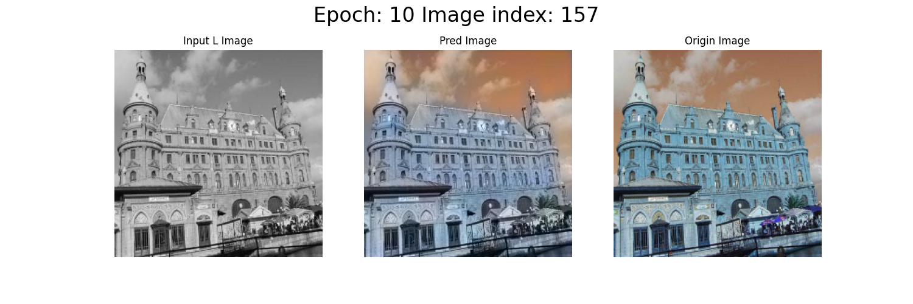

# ChromaGANPytorch

Pytorch implementation of [ChromaGAN](https://github.com/pvitoria/ChromaGAN.git). `torch>=2.1.2 python>=3.9`

## Prepare Environment

Kaggle notebook or Colab. All Python packages in Kaggle notebook are listed in `requirements.txt`

```
%cd ChromaGANPytorch/SOURCE

# Create directory hierarchy
!python config.py

# Prepare train/test/inference data
!ln -s /kaggle/input/image-colorization-dataset/data/train_black ../DATASET/imagenet/train_black/train_data
!ln -s /kaggle/input/image-colorization-dataset/data/train_color ../DATASET/imagenet/train_color/train_data

!ln -s /kaggle/input/image-colorization-dataset/data/test_black  ../DATASET/imagenet/test_black/test_data
!ln -s /kaggle/input/image-colorization-dataset/data/test_color  ../DATASET/imagenet/test_color/test_data

!ln -s /kaggle/input/image-colorization-dataset/data/test_black  ../DATASET/imagenet/infer_black/infer_data

# Dataset validation
!python image_dataset.py
```

## Directory Hierarchy

```
# Train data path:
../DATASET/imagenet/train_black/
../DATASET/imagenet/train_color/

# Test data path:
../DATASET/imagenet/test_black/
../DATASET/imagenet/test_color/

# Infer data path:
../DATASET/imagenet/infer_black/

# Trained model checkpoints path:
../MODEL/imagenet/

# Train logs path:
../LOGS/imagenet/

# Test / Inference output data path: 
../RESULT/imagenet/
```

## Train

```
!python train.py

# Training loss visualization
tensorboard --logdir=../LOGS/imagenet
```

## Test

```
# Upload or link the model checkpoint file to `../MODEL/imagenet/`
!ln -s /kaggle/input/chromagan-pytorch-2024/pytorch/default/1/epoch_00010_2024-08-16_10-24-46.pt ../MODEL/imagenet/epoch_00010_2024-08-16_10-24-46.pt

!python test.py
```

Output example:




## Inference

```
# Upload or link the model checkpoint file to `../MODEL/imagenet/`
!ln -s /kaggle/input/chromagan-pytorch-2024/pytorch/default/1/epoch_00010_2024-08-16_10-24-46.pt ../MODEL/imagenet/epoch_00010_2024-08-16_10-24-46.pt

!python infer.py
```


### Merge all test / inference output images

If there are only a few images, then we can merge them into one image.

```
!python utils.py
```

### Show the merged image

```
import PIL

img = PIL.Image.open("../RESULT/imagenet/merged.png")
img
```

